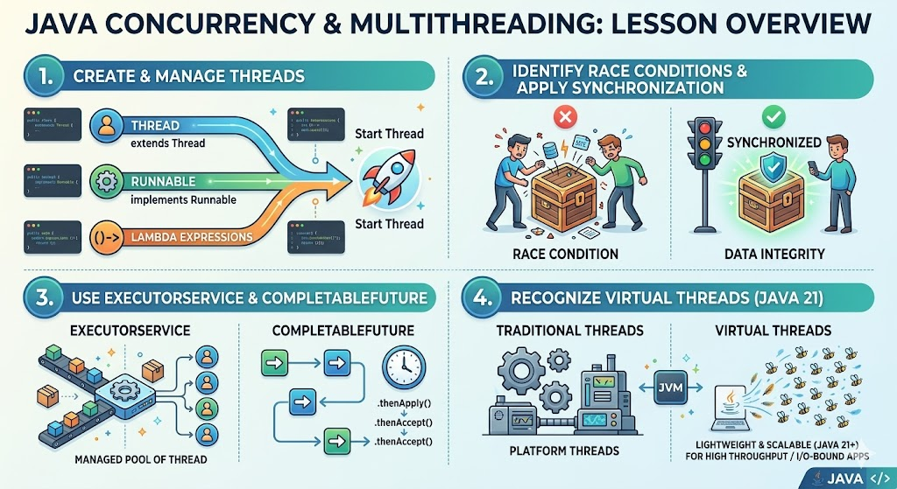

# [3.10] Java Multithreading

## Lesson Overview

## Dependencies

- [Self Studies](./studies.md) / [Lesson](./lesson.md) / [Assignment](./assignment.md) / [Slide Deck](./slides.md)

## Lesson Objectives

By the end of this lesson, students will be able to:

* **Create** and manage threads using `Thread`, `Runnable`, and lambda expressions
* **Identify** race conditions and apply synchronization to prevent them
* **Use** `ExecutorService` and `CompletableFuture` for efficient concurrent programming
* **Recognise** when to use virtual threads (Java 21) for scalable applications

## Lesson Plan

| Duration | What | How or Why |
|---|---|---|
| 10 min | Warm-up | Recap lambdas and functional interfaces from previous lesson — connects directly to how threads are written in this lesson |
| 15 min | Part 1: CPUs, Processes, Threads, Concurrency vs Parallelism | Conceptual foundation — students need to understand what a thread is before creating one |
| 25 min | Part 2: Creating Threads — Thread class, Runnable, lambda, sleep & interrupt | Code-along in `LearnThreads.java`; covers all three thread creation approaches and demonstrates sleep/interrupt |
| 10 min | Activity 1 — calculateBigNumber with Thread + Runnable | Students apply both approaches independently |
| 20 min | Race Condition + Synchronization (BankAccount) | Code-along in `MultipleThreads.java`; demonstrates the problem first, then the fix with `synchronized` |
| 10 min | Break | — |
| 20 min | Part 3: ExecutorService and thread pooling | Code-along in `LearnExecutors.java`; covers fixed thread pool, execute(), shutdown(), and pool size effects |
| 25 min | Part 4: CompletableFuture | Code-along in `LearnCompletableFuture.java`; covers runAsync, supplyAsync, thenAccept, exceptionally, and allOf |
| 15 min | Part 5: Virtual Threads (Java 21) | Code-along in `LearnVirtualThreads.java`; covers all 3 creation methods and scalability demo |
| 5 min | Activity 2 — Swap ExecutorService to virtual threads | Students modify existing code to use `newVirtualThreadPerTaskExecutor()` and observe the difference |
| 15 min | Wrap-up | Recap key concepts: thread lifecycle, race conditions, ExecutorService vs CompletableFuture vs virtual threads |
| **180 min** | **Total** | |